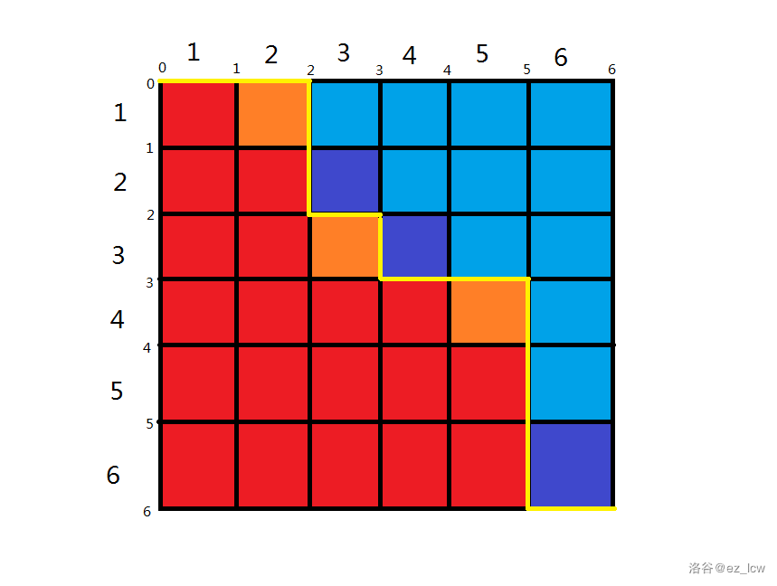

## USACO 2020 US Open Contest, Platinum

### [Sprinklers 2: Return of the Alfalfa](http://www.usaco.org/index.php?page=viewproblem2&cpid=1044)


Solution: Imagine a boundry that cuts the two of the areas in half, at every “turn”, we would need to place a sprinkler of one type on the inside of the right turn. 



We use dynamic programming to compute this effectively in $O(n^2)$ time

$dp[i][j][k]$ where 0<=i,j<=n d: 0,1

represent when the line currently is drawn to (i,j), the current segment is coming from horizontal(0), or vertical(1) direction, the total number of possibilities considering only the first i rows.

k is important because we need to check if we have corners and if so can we place them as well as deducting the number of possibilities associated with them.

When we ever meet a corner, the number of possibilities would decrease by half. To implement this, see Modular Division Trick.

Core code:

```c++
	ll multiplier=power[numAvail[i]];
	dp[i][j][1]=((board[i][j]=='.')*(multiplier*dp[i-1][j][0])/2+multiplier*dp[i-1][j][1]);
	dp[i][j][0]=(board[i][j]=='.')*(dp[i][j-1][1]*500000004)%MOD+dp[i][j-1][0];
```

When going down vertically, we increase the number of rows thus introducing new cells that could have more possibilities which forms the multiplier.

#### Related Topic: Modular Division Trick

Use modular inverse on the divisor, and use multiplication on the dividend. This will work on prime numbers only for mod.

A general code for a^b%m

```c++
ll power(ll x,ll y,ll m){
   if (y==0) return 1;
   ll p=power(x,y/2,m)%m;
   p=(p*p)%m;
   return (y%2==0)?p:(x*p)%m;
}
```

Using this code, the modular inverse of a would be $power(a,m-2,m)$;

Then, we can get the full division formula

```c++
ll divide(ll x, ll y, ll m){
	return (x*power(y,m-2,m))%m;
}
```

Usual mod inverses of 1e9+7:

| y    | modinv(y) |
| ---- | --------- |
| 2    | 500000004 |
| 3    | 333333336 |

 [p-1.cpp](../USACO/2020-usopen/p-1.cpp)
